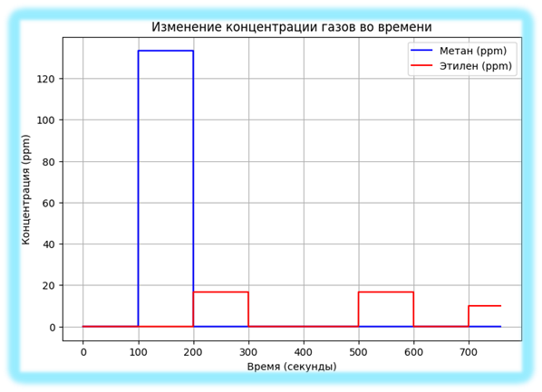
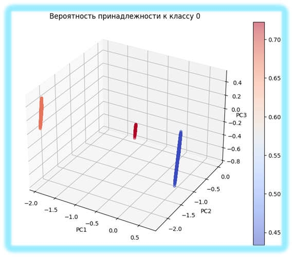
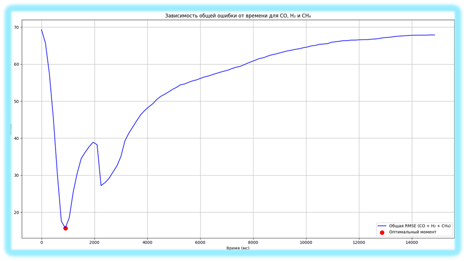

# Анализ газовых смесей методами машинного обучения

## 🚀 О проекте

Этот проект — часть моей магистерской исследовательской работы. Его цель — разработать и оптимизировать модели машинного обучения для **классификации** состава газовых смесей и **прогнозирования** их концентрации на основе данных с сенсорных массивов ("электронный нос").

> **TL;DR:** Я разработал пайплайн, который с высокой точностью определяет состав газа и находит оптимальное время для измерений, чтобы минимизировать ошибку прогноза.

### 🎯 Ключевые результаты и достижения:

*   ✅ **Достигнута точность классификации 97.5%** при определении состава газовой смеси.
*   🎯 **Снижена общая ошибка прогнозирования (RMSE) до 15.74%** за счет определения оптимального момента для снятия показаний.
*   ⏱️ **Найден оптимальный момент времени для измерений (900.9 мс)**, что позволяет ускорить анализ и повысить его надежность.

---

## 🔬 Эксперименты и результаты

Работа была разделена на два ключевых эксперимента.

### Эксперимент 1: Классификация состава газовой смеси

**Задача:** Научить модель отличать чистый воздух от воздуха с примесями метана и этилена.

**Классы для классификации:**
*   **Класс 0:** Чистый воздух
*   **Класс 1:** Смесь воздуха и метана
*   **Класс 2:** Смесь воздуха и этилена

**Результаты:**
После предобработки данных и обучения модели `SVM` были получены следующие метрики на тестовой выборке:

| Метрика  | Значение |
| :------- | :------- |
| Accuracy | **0.975**|
| Precision| 0.650    |
| Recall   | 0.667    |
| F1-score | 0.658    |

 

**Визуализация данных:**

Слева — изменение концентрации газов во времени (входные данные). Справа — визуализация классов в пространстве главных компонент (после PCA), где цветом показана вероятность принадлежности к классу "чистый воздух".

| Входные данные | Пространство признаков |
| :---: | :---: |
|  |  |

### Эксперимент 2: Оптимизация времени измерения для прогнозирования

**Задача:** Найти такой момент времени для снятия показаний с сенсоров, который минимизирует ошибку прогноза концентраций угарного газа (CO), водорода (H2) и метана (CH4).

**Подход:**
Была рассчитана общая ошибка `Total RMSE` как среднее из ошибок прогноза для каждого газа:
$Total\ RMSE = \frac{RMSE_{CO} + RMSE_{H2} + RMSE_{CH4}}{3}$

**Результат:**
График зависимости общей ошибки от времени показал, что **минимальная ошибка в 15.74% достигается при измерении на 900.9 миллисекунде**.

Это открытие позволяет значительно сократить время анализа, сохранив при этом высокую точность прогнозов.

---

## 🛠️ Технологический стек

*   **Язык программирования:** `Python`
*   **Библиотеки для анализа и ML:** `Pandas`, `NumPy`, `Scikit-learn`, `TensorFlow`
*   **Визуализация:** `Matplotlib`
*   **СУБД:** `SQL` (для хранения и извлечения данных)
