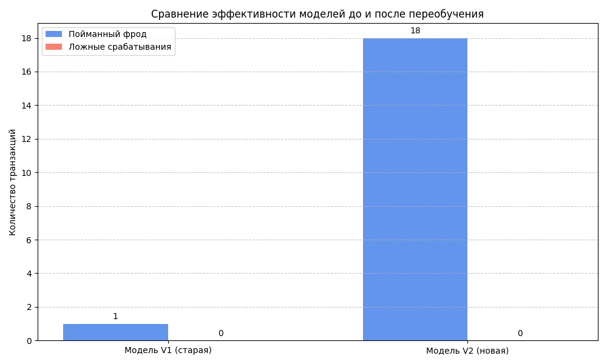

# Симуляция антифрод-системы: Демонстрация деградации модели и необходимости переобучения

Этот проект представляет собой симуляцию работы системы обнаружения мошеннических транзакций. Основная цель — наглядно продемонстрировать, почему статичная модель машинного обучения со временем теряет свою эффективность ("деградирует") и почему необходим процесс регулярного переобучения для борьбы с адаптирующимся мошенничеством.

## Ключевая идея

В реальном мире мошенники постоянно меняют свои тактики, а поведение легальных клиентов эволюционирует. Этот процесс называется **"дрейфом концепта" (Concept Drift)**. Модель, обученная на старых данных, быстро устаревает.

Симуляция доказывает ценность **контролируемого обучения (Supervised Learning)** и процесса **MLOps** на примере следующих шагов:
1.  **Модель V1 ("Чемпион")** обучается на исторических данных, где мошенники используют один тип атаки.
2.  Модель проверяется на "будущих" данных, где мошенники **адаптировались** и используют новый паттерн атаки.
3.  **Модель V2 ("Претендент")** переобучается на всех доступных данных (старых и новых).
4.  Результаты V1 и V2 сравниваются, доказывая, что только переобученная модель способна эффективно бороться с дрейфом концепта.

## Результаты

Визуализация наглядно демонстрирует, как старая модель (V1) практически полностью "ослепла" к новому типу фрода, в то время как переобученная модель (V2) успешно к нему адаптировалась, сохранив при этом низкий уровень ложных срабатываний.

## Методология и выбор модели

-   **Инжиниринг признаков:** Ключевым фактором успеха является создание информативных признаков, таких как `amount_z_score` (на сколько стандартных отклонений транзакция отличается от среднего для данного пользователя) и `time_since_last_tx` (время с последней операции). Эти признаки позволяют модели улавливать аномалии в контексте поведения конкретного пользователя, а не по абсолютным значениям.

-   **Выбор модели:** `RandomForestClassifier` был выбран как надежный и интерпретируемый ансамблевый метод. Он хорошо работает с разномасштабными признаками, устойчив к переобучению и позволяет оценить важность признаков. Параметр `class_weight='balanced'` помогает модели уделять больше внимания редкому классу (фроду).

-   **Валидация:** Применяется строгое разделение данных по времени (`train/validation split`) для симуляции реальной ситуации, когда модель, обученная на прошлом, должна работать на будущем. Это позволяет избежать утечки данных и получить честную оценку эффективности.

## Возможные улучшения

Данный проект является доказательством концепции. В реальной боевой системе его можно было бы развить следующими шагами:
1.  **Автоматизация (MLOps):** Создать автоматический пайплайн для регулярного переобучения модели на свежих данных и мониторинга ее производительности.
2.  **Расширение набора признаков:** Добавить больше данных о транзакции (например, геолокация, тип устройства, категория магазина) для повышения точности.
3.  **A/B тестирование:** Внедрить новую модель в "теневом режиме" или для небольшой доли пользователей, чтобы сравнить ее с текущей системой на реальных данных перед полным развертыванием.

## Используемые технологии
- Python
- Pandas
- Scikit-learn (`RandomForestClassifier`, `StandardScaler`)
- NumPy
- Matplotlib (для визуализации)
